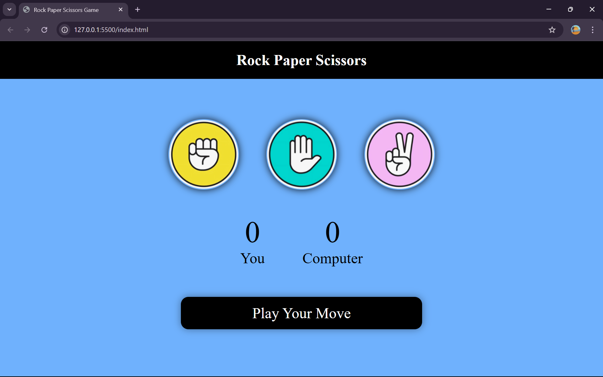

# 🎮 Rock Paper Scissors  

A fun and interactive **Rock Paper Scissors** game built with **HTML, CSS, and JavaScript**.  
Challenge the computer, keep score, and enjoy a smooth UI with colorful visuals.  

---

## 🚀 Live Demo  

👉 [Play Rock Paper Scissors Online](https://BharathPadavu.github.io/rock-paper-scissors/)  

---

## ✨ Features
- 🎯 **Play against the computer** – the computer randomly picks Rock, Paper, or Scissors.  
- 🏆 **Real-time score tracking** – your score and the computer’s score update instantly.  
- 🎨 **Colorful and interactive UI** – hover effects and color-coded messages for win, lose, or draw.  
- 📱 **Basic responsive design** – adapts to smaller screen sizes like tablets and phones.  

---

## 🛠 Tech Stack


---

## 📸 Screenshot  



---

## ⚡ Getting Started  

### 🔹 Run Locally
1. Clone the repository:
   ```bash
   git clone https://github.com/BharathPadavu/rock-paper-scissors.git
